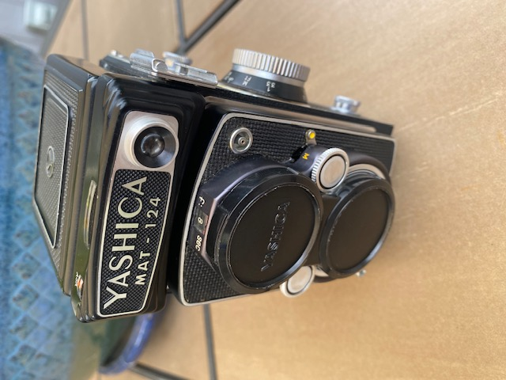
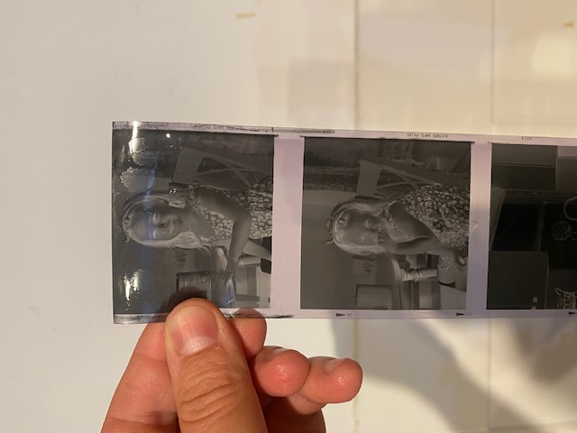
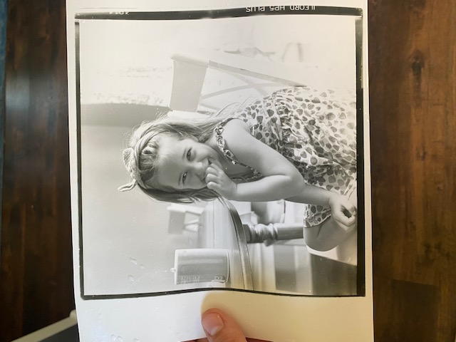
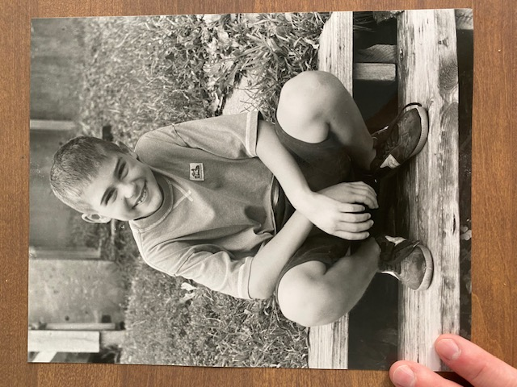

# Beginnings
*August 6, 2026*

A few weeks ago I was fortunate to find an amazing deal on two vintage cameras and basically a whole darkroom setup including chemicals. 
One was a Yashica Mat-124 TLR (120) from 1969 was a Graflex Super Graphic (4x5) from the same era. 

After cleaning them up and testing the shutters, I loaded a roll of HP5+ into the Yashica and took some photos.
I then developed the roll with D-76 and a basic developing tank. I was so excited when I saw the negatives!

The next order of business was to clean up the enlarger and make some prints. After making some test strips to dial in the exposure time, I exposed the paper and developed it. There is something magical about watching the image appear in the developer tray.

My composition and prints are not perfect (as my wife likes to point out) but I absolutely love this process. 

